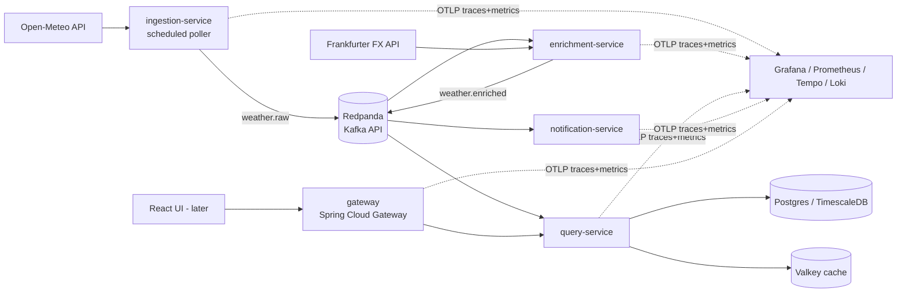
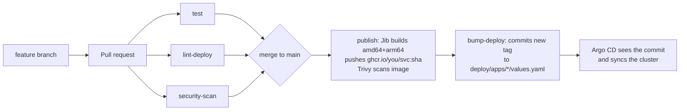

# TravelPulse

A learning-first, event-driven microservices platform that pulls live travel data (weather and FX to start) and will later power a React map UI and AI features. Everything here runs for **$0**.

The first data flow is live weather for a handful of cities (Open-Meteo, no API key) → enriched with USD exchange rates (Frankfurter, no API key) and a "travel comfort score" → stored in Postgres, cached in Redis/Valkey, served through an API gateway, with alerts when conditions get bad.



---

## 1. Stack decisions (and what I swapped)

| Area | Choice | Why |
|---|---|---|
| Language | Java 21 + Spring Boot 3.5 | Matches Spring Cloud Gateway and Jib. Upgrading to Boot 4 later is a good exercise. |
| Messaging | **Redpanda** (over NATS) | It speaks the Kafka API, so you learn Spring Kafka, the skill employers ask for, while running a single light binary. |
| Cache | **Valkey** (drop-in for Redis) | The fully open-source Redis fork. Spring Data Redis works unchanged. |
| DB | Postgres 16 with TimescaleDB available | The schema is already hypertable-ready. |
| Images | **Jib** (no Dockerfiles) | Reproducible, layered images. CI doesn't need Docker to build them. Docker is still used for running things locally. |
| IaC | **OpenTofu** (over Terraform) | The open-source fork: same HCL, same providers. |
| K8s packaging | **One generic Helm chart** reused by all services | Adding a service means adding one values file. |
| GitOps | Argo CD ApplicationSet | Auto-creates one app per folder in `deploy/apps/`. |
| Postgres on K8s | CloudNativePG operator | Bitnami charts are no longer a safe free default. CNPG is the modern standard. |
| Observability | `grafana/otel-lgtm` all-in-one | Grafana, Prometheus, Tempo, Loki and the OTel Collector in one container. You graduate to separate Helm charts later. |
| Security | Trivy (fs, secrets, misconfig, image) + Dependabot + pinned actions | See §7. |

---

## 2. Where it runs: three stages

| Stage | Where | What you learn | Cost |
|---|---|---|---|
| **1. Local dev** | Laptop: Docker Compose for infra, services from your IDE | Spring, Kafka, JPA, testing | $0 |
| **2. Local Kubernetes** | Laptop: **k3d** (k3s in Docker) + Argo CD + Helm | K8s, Helm, GitOps, operators | $0 |
| **3. Cloud** | **Oracle Cloud Always Free** ARM VM (4 OCPU / 24 GB) running k3s, provisioned by OpenTofu | IaC, real hosting, TLS, ingress | $0 within free limits |

GitHub (public repo) gives you free Actions minutes and free GHCR image hosting for public packages.

**Laptop sizing:** stage 2 wants roughly 8 GB of RAM free for Docker. If your machine is tighter, stay in stage 1 longer or jump straight to stage 3. The Oracle VM is far bigger than most laptops.

**Oracle notes:** A1 capacity is often "out of capacity" in popular regions, so retry or pick a quieter home region at signup (you can't change it later). Oracle may reclaim Always Free instances that sit idle. Upgrading the account to Pay-As-You-Go avoids that, and you still pay nothing if you stay inside free limits. Set a budget alert anyway.

---

## 3. Prerequisites (install as you reach each stage)

**Stage 1:** Git, JDK 21 (Temurin), Maven 3.9+, Docker Desktop / Docker Engine / Podman, an IDE (IntelliJ Community or VS Code), `make`, and `trivy` (`brew install trivy` builds from source; otherwise use your distro package).

**Stage 2:** `kubectl`, `helm`, `k3d`, optionally `k9s` (a terminal UI for clusters), and the `argocd` CLI.

**Stage 3:** `tofu` (OpenTofu), plus an Oracle Cloud account with an API key.

Optional: `act` (runs GitHub Actions locally) and `pre-commit`.

Then generate the Maven wrapper once, so CI and your laptop use the same Maven version:

```bash
mvn wrapper:wrapper
```

---

## 4. Stage 1: run it on your laptop

```bash
make infra-up                 # Postgres, Valkey, Redpanda, Redpanda Console, Grafana stack
make test                     # all tests (Docker must be running for Testcontainers)

# each in its own terminal (or IDE run configs)
make run-query-service
make run-enrichment-service
make run-notification-service
make run-gateway
make run-ingestion-service    # starts polling after 5s; set POLL_INTERVAL=PT30S while developing
```

Check it:

```bash
curl -s localhost:8080/api/conditions | jq            # through the gateway
curl -s localhost:8080/api/conditions/lisbon/history | jq
curl -s localhost:8083/actuator/health | jq
```

| UI | URL |
|---|---|
| Redpanda Console (topics, messages) | http://localhost:8090 |
| Grafana (admin/admin) | http://localhost:3000. Use Explore → Tempo to see one trace span all 4 services. |

**Local ports:** gateway 8080, ingestion 8081, enrichment 8082, query 8083, notification 8084. In Kubernetes all services use 8080.

---

## 5. Testing strategy: what runs when

| Layer | Example in repo | Runs |
|---|---|---|
| Pure unit | `TravelScoringTest`, `AlertRulesTest` | Laptop + every PR, in milliseconds |
| Unit with mocks | `WeatherPollerTest`, `EnrichmentListenerTest` | Laptop + every PR |
| Integration (real Postgres via Testcontainers) | `ConditionsServiceIntegrationTest` | Laptop + every PR (GitHub runners have Docker) |
| Context smoke | `GatewayApplicationTest` | Laptop + every PR |
| Chart lint/render | `lint-deploy` job | Every PR |
| Security scan | `security-scan` job + image scan | Every PR / every image |
| IaC validate | `iac.yml` | PRs touching `infra/` |

Next tests to add as you learn: a Kafka round-trip test with a Redpanda Testcontainer (`org.testcontainers:redpanda`), contract tests for event JSON, and a post-deploy smoke test that curls the gateway after Argo CD syncs.

**Run a single test:** `mvn -pl services/query-service test -Dtest=ConditionsServiceIntegrationTest`

**Run the pipeline locally:** `act pull_request -j test`

---

## 6. GitHub + CI/CD setup

### 6.1 Create the repo

```bash
# replace YOUR_GH_USER everywhere (macOS: sed -i '' ...)
grep -rl YOUR_GH_USER . | xargs sed -i 's/YOUR_GH_USER/<your-github-username-lowercase>/g'

git init -b main
git add .
git commit -m "chore: bootstrap travelpulse"
gh repo create travelpulse --public --source=. --push   # or create on github.com and push
```

### 6.2 Pipeline flow



CI never gets cluster credentials. It only pushes images and a Git commit, and the cluster pulls its own changes. That's GitOps, and it's why this also works for a cluster on your laptop behind NAT.

### 6.3 One-time GitHub settings

1. **Branch protection (Settings → Rules → Rulesets → New branch ruleset, target `main`).** Require a pull request and require the status checks `test`, `lint-deploy` and `security-scan`. Your daily loop is then: branch → PR → green checks → merge.
2. **Let `bump-deploy` push to protected `main`.** Run `ssh-keygen -t ed25519 -f deploy_key -N ""`. Add `deploy_key.pub` under Settings → Deploy keys (tick *Allow write access*), and add that deploy key to the ruleset's bypass list. Store the private key as the Actions secret `DEPLOY_KEY`. Without branch protection you can skip this step.
3. **Make the images public.** After the first successful `publish`, go to your GitHub profile → Packages → each package → Package settings → Change visibility → Public. Otherwise your cluster needs an `imagePullSecret`.
4. **Pin actions to SHAs.** Resolve the `# TODO: pin` lines in `ci.yml` (instructions are at the top of that file). Dependabot will keep them updated.

### 6.4 Everyday "did my push work?" checklist

1. **PR checks tab:** tests, chart lint and Trivy must all be green. Failed test reports are uploaded as an artifact.
2. **After merge, the Actions tab** shows the `publish` matrix (one job per service) followed by `bump-deploy`.
3. **Commit history** shows a new `deploy: images <sha>` commit.
4. **In the Argo CD UI,** apps go OutOfSync → Syncing → Healthy.
5. **Smoke test:** `curl http://travelpulse.localhost:8080/api/conditions`
6. **In Grafana,** new traces appear for the new version.

---

## 7. Security baseline (already wired in)

Trivy scans dependencies, secrets and Helm/K8s/OpenTofu misconfiguration on every PR, and every published image. The build fails on fixable HIGH/CRITICAL findings; accepted risks go in `.trivyignore`, each with a reason.

GitHub Actions are to be pinned by commit SHA. `aquasecurity/trivy-action` itself had most of its tags hijacked in March 2026, which is exactly the attack SHA pinning prevents. Also turn on Dependabot alerts and secret scanning (free on public repos).

Containers run as non-root with a read-only root filesystem and all Linux capabilities dropped. The service-account token isn't mounted.

Secrets live in Kubernetes Secrets, never in Git; the CNPG operator generates DB credentials for you. Next step: **Sealed Secrets** or **SOPS** when you need API keys (e.g. for AI providers).

The OCI VM only allows SSH from your IP, and the Kubernetes API is not exposed. For kubectl access, tunnel:

```bash
ssh -L 6443:127.0.0.1:6443 ubuntu@<vm-ip>
scp ubuntu@<vm-ip>:/etc/rancher/k3s/k3s.yaml ~/.kube/oci.yaml   # (sudo cp + chown on the VM first)
KUBECONFIG=~/.kube/oci.yaml kubectl get nodes
```

---

## 8. Stage 2: local Kubernetes with GitOps

```bash
make cluster-up                      # k3d + CloudNativePG + Argo CD, prints admin password
kubectl apply -f deploy/argocd/      # platform app + ApplicationSet for all services
kubectl -n argocd port-forward svc/argocd-server 8443:443   # https://localhost:8443
curl http://travelpulse.localhost:8080/api/conditions
kubectl -n travelpulse port-forward svc/observability 3000:3000
```

**No GitHub pipeline yet?** Run `make local-deploy` instead. It builds images with Jib into local Docker, imports them into k3d, and Helm-installs everything directly.

**Useful commands:** `k9s`, `kubectl -n travelpulse get pods`, `kubectl -n travelpulse logs deploy/query-service -f`, and `helm template x deploy/charts/microservice -f deploy/apps/query-service/values.yaml` to see exactly what gets applied.

---

## 9. Stage 3: Oracle Cloud with OpenTofu

```bash
cd infra/tofu/oci
cp terraform.tfvars.example terraform.tfvars    # fill in OCIDs, key path, region, your IP/32
tofu init
tofu plan
tofu apply                                      # prints public_ip
```

Cloud-init installs k3s. Then, over the SSH tunnel from §7, install CNPG and Argo CD exactly as in `scripts/cluster-up.sh` (skip the k3d line) and `kubectl apply -f deploy/argocd/`. The same Git repo now drives both clusters. Images are multi-arch, so the ARM VM just works.

**Later:** point a free DNS name at the VM (e.g. DuckDNS) and add cert-manager with Let's Encrypt for HTTPS.

---

## 10. Repo layout

```
.
├── pom.xml                         parent: versions, shared observability deps, Jib config
├── services/
│   ├── ingestion-service/          @Scheduled poller → weather.raw
│   ├── enrichment-service/         weather.raw → FX + score → weather.enriched
│   ├── query-service/              weather.enriched → Postgres; REST API; Redis cache; Flyway
│   ├── notification-service/       weather.enriched → alert rules
│   └── gateway/                    Spring Cloud Gateway routes
├── local/docker-compose.yml        stage 1 infra
├── deploy/
│   ├── charts/microservice/        the one reusable Helm chart
│   ├── apps/<service>/values.yaml  per-service config (CI bumps image.tag here)
│   ├── platform/                   in-cluster Postgres (CNPG), Valkey, Redpanda, Grafana stack
│   └── argocd/                     Application + ApplicationSet
├── infra/tofu/oci/                 stage 3 VM
├── scripts/                        cluster-up, local-deploy
├── .github/workflows/              ci.yml, iac.yml
└── Makefile                        `make help`
```

---

## 11. Roadmap (suggested order)

1. **Harden the backend.** Add a Kafka dead-letter topic (`DefaultErrorHandler` + `DeadLetterPublishingRecoverer`), idempotent consumers, Resilience4j retries and circuit breakers on external HTTP calls, and gateway rate limiting with Redis.
2. **More live data.** Add flights (OpenSky Network, free account), air quality (Open-Meteo), and public holidays (Nager.Date). Each is a new poller in ingestion or its own service.
3. **Time series.** Turn on TimescaleDB (a custom CNPG image or Timescale's chart) and add continuous aggregates for "last 7 days" charts.
4. **Push to clients.** Add an SSE endpoint (a Spring MVC `SseEmitter`, or WebFlux) in query or notification, routed via the gateway.
5. **Frontend.** React + Vite + TypeScript + Tailwind, TanStack Query for fetching and caching, EventSource for SSE, and MapLibre GL with free OpenStreetMap-based tiles. Serve it as another container behind Traefik.
6. **AI.** A separate `assistant-service` (Spring AI) behind `/api/assistant/**`. Use Ollama locally for $0 models, and tool-calling against the query API ("where's warm and cheap this weekend?").
7. **Platform upgrades.** Replace otel-lgtm with kube-prometheus-stack + Tempo + Loki, add Sealed Secrets, try Argo Rollouts for canaries, move to Spring Boot 4, and switch the OpenTofu state to encrypted remote storage.

---

## 12. Troubleshooting

| Symptom | Fix |
|---|---|
| Testcontainers can't find Docker | Start Docker Desktop. With Podman or Colima, set `DOCKER_HOST` (see the Testcontainers docs). |
| Services log `Connection to node -1 could not be established` | Redpanda isn't up yet. Check `docker compose -f local/docker-compose.yml ps`. |
| `/api/conditions` returns `[]` | Wait about a minute for the first poll; check ingestion logs and the topics in Redpanda Console. |
| Pod stuck in `ImagePullBackOff` | The GHCR package is still private (§6.3.3), or the tag doesn't exist yet. |
| `jib:dockerBuild` platform error | Don't combine `-Pmultiarch` with `dockerBuild`. Multi-arch is for `jib:build` (CI) only. |
| Hibernate schema validation error on startup | The entity and the Flyway SQL drifted. Add a new `V2__...sql` migration; never edit V1 after it has run. |
| OCI `Out of host capacity` | Retry later, or try another availability domain. |
